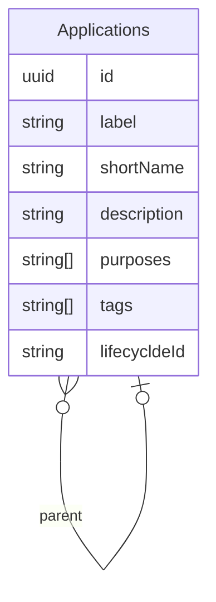

# Modèle de données

```mermaid
erDiagram
    Applications }o --o| Applications : parent
    Applications {
         uuid id
         string label               
         string shortName
         string description
         string[] purposes
         string[] tags
         string lifecycldeId 
    }
```
