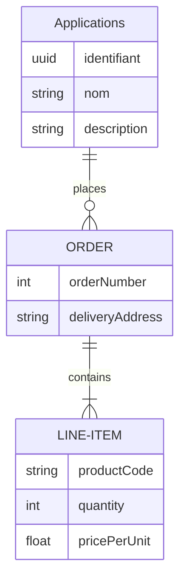

# Modèle de données

```mermaid
erDiagram
    Applications ||--o{ ORDER : places
    Applications {
        uuid identifiant
        string nom
        string description
    }
    ORDER ||--|{ LINE-ITEM : contains
    ORDER {
        int orderNumber
        string deliveryAddress
    }
    LINE-ITEM {
        string productCode
        int quantity
        float pricePerUnit
    }

```
