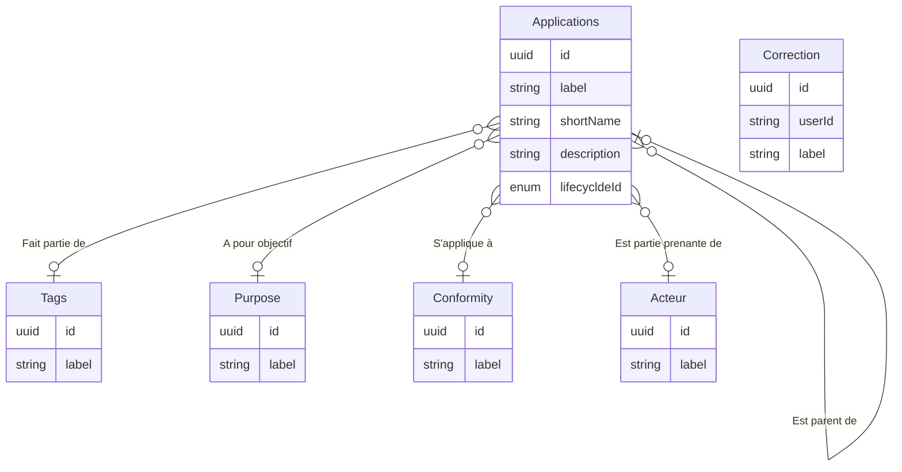

# Modèle de données

## Dictionaire
| Objet | Id | Nom | Description |
|--|--|--|--|
| Application | id | Identifiant unique | Identifiant unique de l'application dans le referentiel des applications |
| Application | label | Nom | Nom de l'application - C'est le champ utilisé pour la recherche |
| Application | shortName | Nom abrégé | Nom abrégé de l'application |
| Application | description | Description | Description de l'application |
| Application | lifecycldeId | Cycle de vie Statut | Indicateur indiquant si l'application est en construction, en production ou décomissioné |
| Tags | tags |label | Nom du tag|
| Purposes | objectifs |label | Nom du tag|
